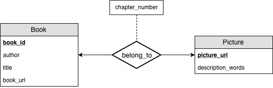

# SE305 DBST Project
Course Project for SE305 Database System Techniques

## Directory
```bash
.
├── LICENSE
├── Project-Description.pdf
├── README.md
├── arxived_report
├── code
│   ├── build_MySQL_database
│   │   ├── create_table.py
│   │   ├── delete_table.py
│   │   └── insert_item.py
│   ├── crawler
│   │   ├── crawl_book_content.py
│   │   └── crawl_book_info.py
│   ├── interface
│   │   ├── default.png
│   │   └── interface.py
│   └── process
│       ├── download_picture.py
│       ├── output
│       └── process.py
└── data_sample
```

## ER Model


## Relational Model
- **Book** (**book\_id**, author, title, book\_url)
- **Picture** (**picture\_url**, description\_words)
- **belong\_to** (**book\_id**, **picture\_url**, chapter\_number)

## Query

```
# Find the books according to the name, author.
def find_book(book_name, author):
	retun book_url

# Given a book and chapter number, you can return some relative pictures.
def find_pic_by_name_chapter(book_name, chapter_num):
	return [pic1_url, pic2_url]

# Given some words, you can find the relative pictures according to the words.
def find_pic_by_words(book_name, words):
	return [pic1_url, pic2_url]
```


